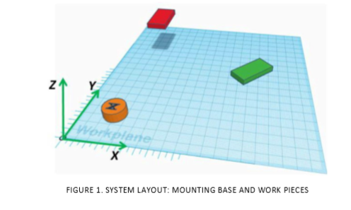
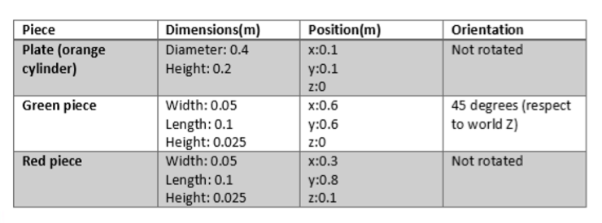

# Design of a SCARA 3-Dof robot manupilator with 1 DoF wrist

## Objective:  
This report presents a design and analysis of a SCARA robot using the theoretical concepts of DH parameters, Forward kinematics, Inverse kinematics implemented in Robotics, Vision & Control: (c) Peter Corke 1992-2019 http://www.petercorke.com, Robotics Toolbox for MATLAB (release 10.3.1) 
 
## Task:  
The expected task performance is to pick an object [Red Piece] and place it on another object [Green Piece] which in the workspace of the designed robot.  

 
## Data: 
The base of the robot and the position of the center of bottom surface of each object was given as data. 

When assigning the frames for links, I considered workspace associated with the task  

1. The origin of **link_frame-1** was assigned with a translation in Z direction above the base of the robot. This distance is        important as it decides the height of the robot in our design. A height so that the robot’s prismatic joint can reach the two target points easily was decided. (0.8m) The orientation of the frame kept consistent with the world coordinate system to avoid unwanted transformations. 
 
2. The origin of **link_frame-2** and **link_frame-3** were assigned with a translation in X direction from link-1.  This configuration avoids any unnecessary offsets in other directions.  The combined distance of these links defines the reach of the robot. Therefore, initially lengths were decided intuitively. Later, distances were updated by trial and error while calculating inverse kinematics. 
 
3. The **link_frame-4** was decided as the wrist of the robot which the tool is attached, and it was located at the same point as the **link_frame-3** adding more flexibility to the tool reaching the orientation of workpiece. 
 
